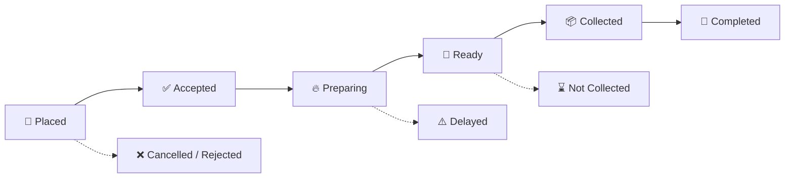

<div align="center">


### 🍔 Skip the line. Grab your food. *FataFat!* ⚡

[](https://react.dev)
[](https://www.typescriptlang.org)
[](https://vitejs.dev)
[](https://tailwindcss.com)
[](https://zustand-demo.pmnd.rs)
[](LICENSE)

**[✨ Features](#-features) • [👥 Roles](#-user-roles) • [🧠 Smart Queue](#-smart-queue-engine) • [🛠 Tech Stack](#-tech-stack) • [🚀 Getting Started](#-getting-started) • [🔑 Demo Accounts](#-demo-accounts)**

</div>

---

## 📖 About

**FataFat Food** is a full-featured **canteen pre-order and digital queue management system**. Customers order ahead, pick a pickup slot, and get a **digital token + QR code**. Kitchen staff work from a **smart priority queue**, and managers get **analytics with AI-powered insights**, all in one fast, modern web app.

> 🎯 **No more long lines. No more guessing when your food is ready.**

---

## ✨ Features

<table>
<tr>
<td width="50%" valign="top">

### 🛒 For Customers
- 🍽️ Browse the menu by category
- 🛍️ Cart & seamless checkout
- ⏰ Choose a **15-minute pickup slot**
- 🎟️ Get a **digital token** (e.g. `C-023`) + **QR code**
- 📍 **Live order tracking** with status updates
- 🔔 In-app notifications + **email alerts**
- 📜 Order history & personal dashboard
- 🤖 Built-in **AI Food Assistant** chatbot
- ⭐ Personalized food recommendations

</td>
<td width="50%" valign="top">

### 👨‍🍳 For Kitchen Staff
- 📋 **Smart kitchen queue** sorted by priority
- ✅ Accept / ❌ reject incoming orders
- 🔥 Update status: *Preparing → Ready*
- 🔍 **Token verification** at the counter
- 📦 Confirm collection in one tap
- ⚠️ Automatic delay detection

</td>
</tr>
<tr>
<td width="50%" valign="top">

### 📊 For Managers
- 🍕 Full **menu management** (add / edit / availability)
- 🕒 **Pickup slot** capacity control
- 📈 Analytics: sales by day, orders by hour
- 🏆 Most & least popular items
- 💡 **AI-generated business insights**
- ⏱️ Delayed order percentage tracking

</td>
<td width="50%" valign="top">

### 🛡️ For Admins
- 👤 **User & role management**
- 🗂️ Category management
- 📝 **System & staff activity logs**
- 🎛️ Platform-wide dashboard

</td>
</tr>
</table>

---

## 👥 User Roles

| Role | Landing Page | Access |
|:----:|:------------:|:-------|
| 🧑‍🎓 **Customer** | `/home` | Menu, cart, orders, tracking, profile |
| 👨‍🍳 **Staff** | `/staff/queue` | Kitchen queue, token verification |
| 📊 **Manager** | `/manager/dashboard` | Menu, slots, analytics + staff tools |
| 🛡️ **Admin** | `/admin/dashboard` | Users, categories, logs + everything above |

Routes are protected with **role-based guards**, so users only see what they're allowed to.

---

## 🔄 Order Lifecycle



---

## 🧠 Smart Queue Engine

Orders aren't just first-come-first-served. The kitchen queue scores every order using:

| Factor | What it does |
|:-------|:-------------|
| ⏳ **Pickup urgency** | Orders due soonest rise to the top |
| 🐌 **Lateness** | Late orders get boosted so nobody is forgotten |
| 🕰️ **Waiting time** | Longer waits increase priority |
| 🍳 **Prep complexity** | Dynamic prep time based on the slowest item, quantity, and current kitchen workload |

Each order gets a **HIGH / MEDIUM / LOW** priority label with a human-readable reason.

---

## 🤖 AI Food Assistant

A floating chatbot helps users with ordering, tokens, tracking, and pickup questions.

- 🌐 Uses **OpenRouter** when an API key is provided
- ⚡ Falls back to a **built-in local knowledge base**, so it works instantly with no key and no network

---

## 🛠 Tech Stack

| Category | Technologies |
|:---------|:-------------|
| **Frontend** | React 19, TypeScript, Vite |
| **Styling** | Tailwind CSS, Lucide Icons, clsx, tailwind-merge |
| **State** | Zustand, TanStack React Query |
| **Routing** | React Router v7 |
| **Charts** | Recharts |
| **QR Codes** | qrcode.react |
| **Notifications** | react-hot-toast, EmailJS |
| **Data Layer** | localStorage-backed DB seeded with demo data |
| **AI** | OpenRouter API (optional) |

---

## 🚀 Getting Started

### Prerequisites
- **Node.js** 18+ and **npm**

### Installation

```bash
# 1. Clone the repository
git clone https://github.com/<your-username>/smart-canteen.git
cd smart-canteen

# 2. Install dependencies
npm install

# 3. Set up environment variables
cp .env.example .env

# 4. Start the dev server
npm run dev
```

Open **http://localhost:5173** 🎉

### Environment Variables

| Variable | Required | Description |
|:---------|:--------:|:------------|
| `VITE_CHATBOT_KEY` | ❌ | OpenRouter API key (`sk-or-v1-...`). Without it, the local chatbot is used |
| `VITE_SUPABASE_URL` | ❌ | Supabase project URL |
| `VITE_SUPABASE_ANON_KEY` | ❌ | Supabase anon key |

### Scripts

| Command | Description |
|:--------|:------------|
| `npm run dev` | Start the development server |
| `npm run build` | Type-check and build for production |
| `npm run preview` | Preview the production build |
| `npm run lint` | Run ESLint |

---

## 🔑 Demo Accounts

The app ships with seeded demo data so you can explore every role instantly:

| Role | Email | Password |
|:----:|:------|:---------|
| 🧑‍🎓 Customer | `customer@demo.com` | `customer123` |
| 👨‍🍳 Staff | `staff@demo.com` | `staff123` |
| 📊 Manager | `manager@demo.com` | `manager123` |
| 🛡️ Admin | `admin@demo.com` | `admin123` |

---

## 📁 Project Structure

```
smart-canteen/
├── public/                  # Static assets (logo, favicon)
├── src/
│   ├── components/
│   │   ├── layout/          # Customer, Staff, Manager, Admin layouts
│   │   └── ui/              # ChatBot, Modal, Logo, StatusBadge, etc.
│   ├── pages/
│   │   ├── auth/            # Login & Sign up
│   │   ├── customer/        # Menu, cart, checkout, tracking, history
│   │   ├── staff/           # Kitchen queue, token verification
│   │   ├── manager/         # Dashboard, menu, slots, analytics
│   │   └── admin/           # Users, categories, system logs
│   ├── services/            # Orders, queue, analytics, chat, email
│   ├── store/               # Zustand stores (auth, app)
│   ├── lib/                 # localStorage DB & storage helpers
│   ├── data/                # Seed / demo data
│   ├── App.tsx              # Routes & role guards
│   └── main.tsx
├── .env.example
└── package.json
```

---

## 🗺️ Roadmap

- [ ] 💳 Online payment integration
- [ ] 🗄️ Full Supabase backend (auth + database)
- [ ] 📱 PWA / installable mobile app
- [ ] 🔔 Push notifications
- [ ] 🌙 Dark mode

---

## 🤝 Contributing

Contributions are welcome!

1. 🍴 Fork the project
2. 🌿 Create your branch: `git checkout -b feature/amazing-feature`
3. 💾 Commit your changes: `git commit -m "Add amazing feature"`
4. 📤 Push to the branch: `git push origin feature/amazing-feature`
5. 🔁 Open a Pull Request

---

## 📄 License

Distributed under the **MIT License**. See `LICENSE` for more information.

---

<div align="center">

### ⭐ If you like this project, give it a star! ⭐

Made with ❤️ and lots of ☕


</div>